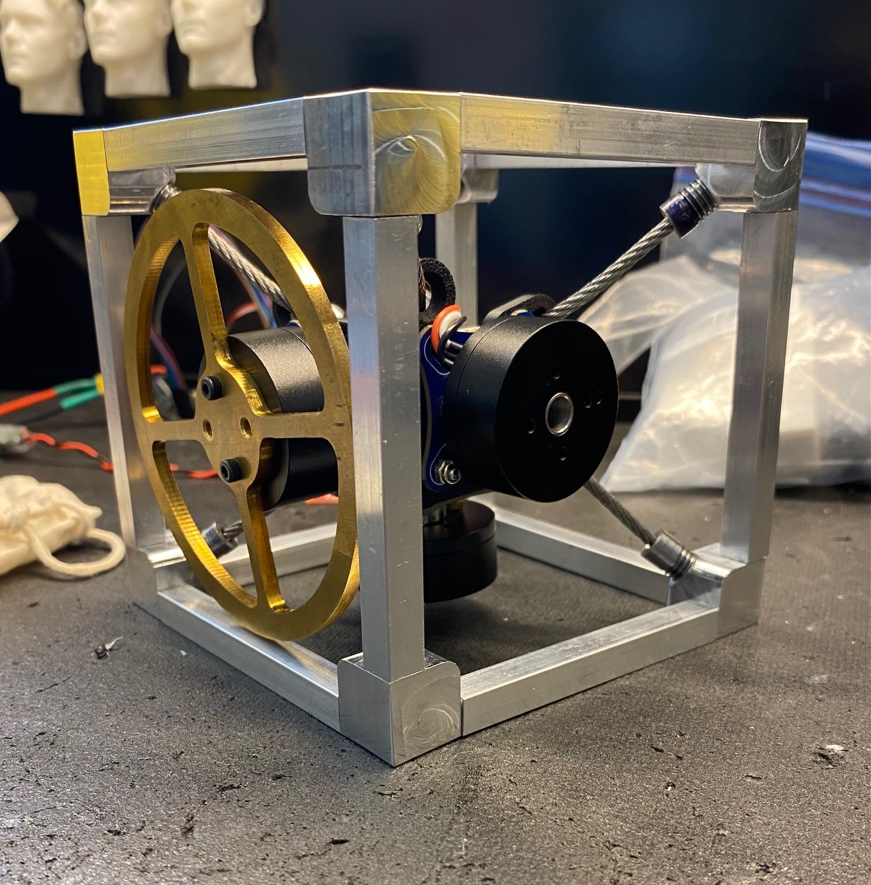

# Cubli — a 3-axis reaction-wheel balancing cube



*First trial fit-up — dry-assembled to check clearances and see how the parts come together.
Not the finished build; frame tensioning, wiring, and final balancing are still in progress.*

A cube that balances on its corner using three orthogonal reaction wheels. Built as
phase one of a two-project arc: the ADCS stack developed here — IMU drivers, quaternion
attitude estimation, nested control loops, BLDC torque control — ports directly to an
active thrust-vector-controlled model rocket.

**Status:** prototype assembled; single-axis controller validated in simulation; **motor
bring-up complete** — one axis spinning under SimpleFOC with the encoder confirming
commanded velocity. Closed-loop edge balance is the next milestone.

---

## Why this project

Reaction-wheel attitude control is the same problem a CubeSat solves in orbit, reduced to
something you can drop on a desk. The wheel saturation, the momentum budget, the sensor
fusion, the torque-vs-momentum trade — all of it is spacecraft ADCS with gravity added as a
disturbance you can't turn off.

I built it to *understand* those things, not to reproduce a demo. Where a decision could
have been hand-waved, the reasoning is written down.

---

## The engineering, in three decisions

**The wheel is torque-limited, not momentum-limited — so bigger isn't better.**
The obvious instinct is to add wheel inertia for more authority. It's wrong. Extra rim mass
raises the gravity torque the wheel has to fight (`mgl`) faster than it raises the momentum
ceiling, and the recovery envelope is bounded by the motor's 0.087 N·m peak, not by stored
momentum. Simulation puts peak wheel speed at 56 % of the flat-torque knee during a worst-case
catch — enormous saturation margin, which is the signature of a torque-bound system. The
inertia target sits at **8.00e-5 kg·m² reflected**: the broad envelope optimum is ~7.5e-5, and
8e-5 is *also* the floor for a multi-swing pump-up hop, so one wheel design serves all three
phases instead of two. → [`docs/HARDWARE.md` §8](docs/HARDWARE.md)

**A sensor's I2C address propagated into the motor wiring harness.**
The AS5600 encoder has a hardwired address of `0x36` and no address pins — so three of them
cannot share a bus. That forces all three of the Teensy 4.1's native I2C peripherals into
service, which claims pins 24/25 for `Wire2`. Those pins happen to be FlexPWM1's sm2-X and
sm3-X outputs. FlexPWM1's usable PWM pool collapses to `{0, 1, 7, 8}`, FlexPWM3 only exposes
one submodule and can't drive a motor at all, and the whole motor pin allocation becomes
*forced* rather than chosen — including one unavoidable stray wire in the M3 harness bundle.
Traceable end to end from an encoder datasheet to a connector. → [`docs/HARDWARE.md` §11.3](docs/HARDWARE.md)

**The frame is a tensegrity, and seven stays is not a guess.**
The motor hub is a free rigid body — 6 DOF. Six cable stays can *locate* it but leave no state
of self-stress, so they'd only go taut under external load: useless as a preloaded mount. The
seventh adds exactly one self-stress state, and that self-stress *is* the preload (Maxwell:
members − 6 = self-stresses − mechanisms). The count is necessary but not sufficient — the
stays must also be arranged off the hub's center, or they lock the translations and leave it
free to spin. → [`docs/FRAME_BUILD_GUIDE.md` §2](docs/FRAME_BUILD_GUIDE.md)

---

## Architecture

Three nested loops:

| Loop | Runs at | Does |
|---|---|---|
| **Attitude** (outer) | 1 kHz | Estimated quaternion → commanded body-axis torques. PD + desaturation for single-axis; LQR for 3-axis. |
| **Allocation** (middle) | 1 kHz | Body-axis torques → per-wheel torques. Trivial for perfectly orthogonal wheels; not for real ones. |
| **Torque** (inner) | SimpleFOC | Per-motor voltage-mode torque with *estimated* current. |

**State estimation:** Madgwick → EKF. Madgwick first, deliberately, so the EKF is understood as
an answer to Madgwick's specific failures rather than adopted as a black box.

**Honest limitation:** the SimpleFOC Mini has no current-sense shunts, so the "current limit" is
enforced against an estimate derived from phase resistance — and copper resistance rises ~0.4 %/°C,
so a hot winding draws more than the estimate believes. A flight reaction-wheel driver carries a
true closed current loop for exactly this reason. Fine for low-duty balancing bursts; documented
rather than papered over.

---

## Hardware

| | |
|---|---|
| MCU | Teensy 4.1 (i.MX RT1062, 600 MHz M7 + FPU) — chosen for its **three native I2C buses** |
| Motors | QiuLovesYT 2804 BLDC ×3 — 220 KV, Kt = 0.0434 N·m/A, 7 pole pairs |
| Drivers | SimpleFOC Mini ×3 (DRV8313) — no current sense |
| Encoders | AS5600 ×3 — 12-bit magnetic, fixed 0x36 |
| IMU | SparkFun ISM330DHCX — raw 6-axis; fusion written from scratch |
| Wheels | CNC C360 brass, spoked, 87 mm OD, 65 g, 8.00e-5 kg·m² reflected |
| Frame | Pre-tensioned aluminum space-frame — 12-tube cage, machined hub, 7 cable stays |
| Power | 4S 650 mAh LiPo, star-ground distribution, 7.5 A fuse, XT30 loop key |

Full spec, wiring, pin map and limits: [`docs/HARDWARE.md`](docs/HARDWARE.md) — the single
source of truth.

---

## Simulation

Every design decision is traced through the sim before anything is cut or flashed.
*Tune in sim, then port* is the workflow, not a slogan.

```
sim/
  params.py       mass properties, motor constants, geometry
  plant.py        1-DOF rigid body + reaction wheel
  motor.py        torque envelope, saturation, back-EMF taper
  controller.py   PD + wheel desaturation
  run.py          disturbance-rejection cases, plots
```

**Validated result:** catches a 3° release + 1.0 rad/s shove down to 0.13° final tilt.
Max recoverable disturbance ≈ 1.6 rad/s (~93 °/s). Balance holds with stock gains across
±30 % on mass and inertia — the design is not gain-fragile.

Locked gains: `Kp 1.40, Kd 0.080, Kw +1e-4`. The sign on `Kw` is load-bearing — flipping it
places a right-half-plane pole and the wheel desaturates *into* the fall.

---

## Roadmap

- [x] Wheel inertia sized, balance confirmed in CAD, sim-validated
- [x] Battery + CM ballast plan closed
- [x] Electrical pin map derived and locked
- [ ] **Phase 1** — single-axis edge balance → *video of the cube balancing on an edge*
- [ ] **Phase 2** — 3-axis corner balance under LQR → *video with disturbance rejection*
- [ ] **Phase 3** — multi-swing pump-up onto a corner → *video of the hop*

---

## Repo layout

```
docs/     HARDWARE.md (source of truth) · FRAME_BUILD_GUIDE.md
          CUBLI_BUILD_CONSIDERATIONS.md · cubli_wiring_reference.html (harness ICD)
sim/      Python plant model, controller, disturbance studies
firmware/ Teensy 4.1 / SimpleFOC — bring-up + IMU sketches
cad/      SolidWorks — frame, hub, wheel, assemblies
```

---

Sam Dearing · B.S. Aerospace Engineering (astronautics), Arizona State University
